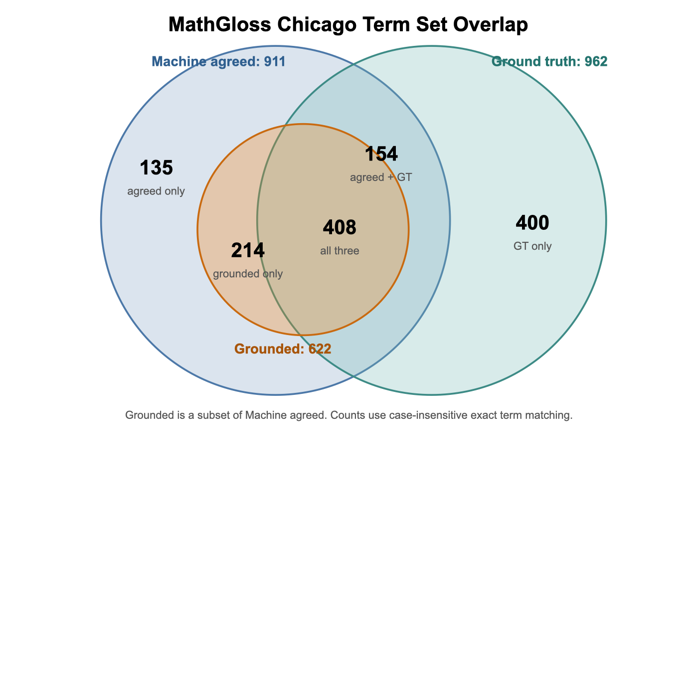

# MathGloss-Chicago Concept Extraction Experiment Summary

**[Update of 08/18]**: 

The 611 terms + definitions as the source corpus is added to [data/mathgloss_chicago_definitions_611terms.txt](https://github.com/NetworkMathematics/IndianaProjects/blob/main/MathConcepts/data/mathgloss_chicago_definitions_611terms.txt). Each sentence is formatted as "[term]: [definition (may contain multiple of sentences)]".

The "ground-truth" set of concepts from the above 611 terms corpus is in [data/mathgloss_chicago_ground_truth_611terms.txt](https://github.com/NetworkMathematics/IndianaProjects/blob/main/MathConcepts/data/mathgloss_chicago_definitions_611terms.txt). There are **962 terms** there and they are from the 611 terms being defined and all the hyperlinked terms in the definition markdown files.

By adding wikipedia as another source to ground the terms + fuzzy search on wikidata/wikipedia on the extracted terms + searching with "[term] + math" when the terms has many wikidata/wikipedia pages + some other tricks, we have a 2nd version of grounding and it now has 832/911 terms being grounded. The overall spreadsheet is in [here](https://docs.google.com/spreadsheets/d/1WmFPND-U0PuxyfCnyr6m2TETOaqCAwJb9RJFMxa1Djk/edit?gid=1056407071#gid=1056407071)

## Setting

We want to check how good our "LLM + wikidata grounding" pipeline for concept extraction from mathematical text is.

Previously, we had a mismatch between the corpus we used to extract the concepts (the 450 lines "chicago_mappings.csv") and the "ground truth" human-annotated set of concepts we considered. 
We had only 395 terms, extracted from https://mathgloss.github.io/MathGloss/web/, restricting ourselves to the Chicago source only.  (Bert, do you know which ones are the 55 concepts that are in chicago_mappings.csv, but not in the spreadsheet under Chicago? Presumably these are math concepts in Chicago notes that do not have WikiData correspondents).

We noticed that there are 611 markdown files in the "Chicago" data folder (https://github.com/MathGloss/MathGloss/tree/main/chicago) and each file defines a concept, but with concepts in the definition sentences marked with hyperlinks to MathGloss. So from there we can get a seemingly "ground truth" set of concepts that can be extracted from these 611 sentences (i.e., the terms that are defined + the terms with a hyperlink in the definition sentences). And this is the source corpus that we are using this time:

- Source markdown folder: [MathGloss/chicago/](https://github.com/MathGloss/MathGloss/tree/main/chicago)
- Extracted sentence corpus formed from the above markdown files: [data/mathgloss_chicago_definition_sentences.txt](https://drive.google.com/file/d/1pyEG4Q_fLb3IzxKx0CaolNfKVKA0gOtP/view?usp=drive_link)
- Sentence metadata CSV: [data/mathgloss_chicago_definition_sentences.csv](https://docs.google.com/spreadsheets/d/1cKQ4N0DxcgQ9tlbmdHPfBs1qwjPCvYIvjmUKr6fgU-I/edit?gid=108875846#gid=108875846)

The corpus contains 611 Markdown pages. Each input sentence is the page title followed by its definition text, e.g. `Abelian Group: ...`.

## Machine Extraction

We ran the 3-LLM extraction pipeline with UD parsing given as part of the context to help them break out the sentences:

- Combined concept CSV: [outputs/mathgloss_chicago_definitions_udep/mathgloss_chicago_definitions_udep_combined_concepts.csv](https://docs.google.com/spreadsheets/d/1cKQ4N0DxcgQ9tlbmdHPfBs1qwjPCvYIvjmUKr6fgU-I/edit?gid=598315717#gid=598315717)

Then we investigated which concepts all LLMs agreed on. The all-model-agreed machine set has 911 terms.

## Grounding Step

We grounded only the terms agreed on by all three LLMs.

- Grounded agreed-terms CSV: [outputs/mathgloss_chicago_definitions_udep_grounded_llm/mathgloss_chicago_definitions_udep_agreed_grounded_llm.csv](https://docs.google.com/spreadsheets/d/1rdqz7vqddWr-msEab0rewEzeSSTJ6db4aKSM60C5f4E/edit?gid=967311553#gid=967311553)

After retrying transient Wikidata/Wikipedia failures, the grounded set has 622 terms. There are no remaining `search failed` or HTTP 429 rows.

## Ground Truth Set

The ground truth set is built from the human-authored MathGloss markdown files:

1. Every page title is included.
2. Every markdown hyperlink bracket text in the definition body is included.
3. Front matter, permalink metadata, image links, and `Wikidata ID` links are excluded.
4. The bracket text is used as the term, not the URL target. For example, `[adjoint map](.../adjoint_map_of_a_Lie_group)` contributes `adjoint map`.

Files:

- Ground truth metadata CSV: [data/mathgloss_chicago_ground_truth_terms.csv](https://docs.google.com/spreadsheets/d/1cKQ4N0DxcgQ9tlbmdHPfBs1qwjPCvYIvjmUKr6fgU-I/edit?gid=1277366660#gid=1277366660)

The current ground truth set has 962 terms.

## Comparison Files

- Machine-agreed terms with source markdown files, definition sentences, grounded flags, and ground-truth match flags: [data/mathgloss_chicago_machine_agreed_review.csv](https://docs.google.com/spreadsheets/d/1cKQ4N0DxcgQ9tlbmdHPfBs1qwjPCvYIvjmUKr6fgU-I/edit?gid=1685887564#gid=1685887564)
- Ground-truth terms with machine-agreed coverage flags: [data/mathgloss_chicago_ground_truth_coverage_review.csv](https://docs.google.com/spreadsheets/d/1cKQ4N0DxcgQ9tlbmdHPfBs1qwjPCvYIvjmUKr6fgU-I/edit?gid=644477911#gid=644477911)

Current summary:

- Ground truth: 962 terms
- Machine agreed: 911 terms
- Machine grounded: 622 terms
- Agreed overlap with ground truth: 562
- Ground truth missing from agreed: 400
- Agreed outside ground truth: 349
- Grounded overlap with ground truth: 408
- Ground truth missing from grounded: 554
- Grounded outside ground truth: 214

[vcvp] more than the numbers, it would be good to know the terms in each of the items above. to see if it's a different concept idealization between Wikidata and Chicago Notes or if the differences are between the LLMs and Wikidata or something else.
